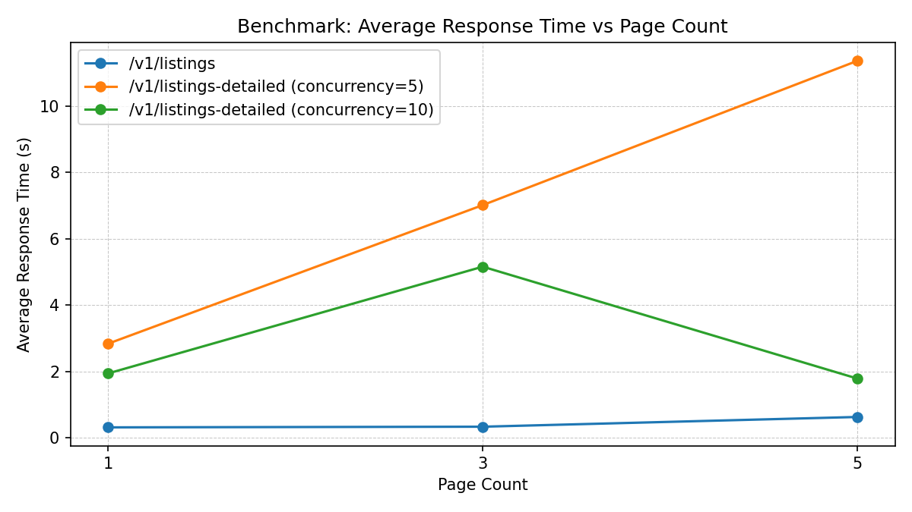

# Ebay Kleinanzeigen API

<div align="center">
  <h3 align="center">Ebay Kleinanzeigen API</h3>

  <p align="center">
    A powerful API interface for Ebay-Kleinanzeigen.de that enables you to fetch listings and specific data.
  </p>

  <p align="center">
    <b>🚀 Looking for a ready-to-use solution?</b>
    <br />
    Try it at <a href="https://kleinanzeigen-agent.de/features/developer-api"><strong>kleinanzeigen-agent.de »</strong></a>
    <br />
    ✓ Automated Search Agents
    <br />
    ✓ Search & Detail API
    <br />
    <a href="https://github.com/DanielWTE/ebay-kleinanzeigen-api/issues">Report Bug</a>
    ·
    <a href="https://github.com/DanielWTE/ebay-kleinanzeigen-api/issues">Request Feature</a>
  </p>
</div>

<p align="right">(<a href="#readme-top">back to top</a>)</p>

## Getting Started

### Want to skip the setup?

Visit [kleinanzeigen-agent.de](https://kleinanzeigen-agent.de/features/developer-api) for our hosted solution with additional features and zero configuration required.

### Prerequisites

- Python 3.12 or higher
- [uv](https://github.com/astral-sh/uv) package manager (recommended)

### Installation

1. Clone the repository

```sh
git clone https://github.com/DanielWTE/ebay-kleinanzeigen-api.git
cd ebay-kleinanzeigen-api
```

1. Install dependencies

```sh
uv sync
```

1. Start the API

```sh
# Development
uv run uvicorn src.app.main:app --reload

# Windows
uv run uvicorn src.app.main:app
```

The API will be available at `http://localhost:8000`

### Installation using Docker

1. Build the Docker image

```sh
docker build -t ebay-kleinanzeigen-api .
```

1. Run the Docker container

```sh
docker run -p 8000:8000 ebay-kleinanzeigen-api
```

The API will be available at `http://localhost:8000`

### API Endpoints

#### 1. Fetch Listings

**Endpoint:** `GET /v1/listings`

**Description:** Retrieves listings as summary records with filtering and pagination.

##### Query Parameters

- **`query`** *(string, optional)*: The search term (e.g., `"fahrrad"`).
- **`location`** *(string, optional)*: Location or city name (e.g., `"Berlin"`).
- **`radius`** *(integer, optional)*: Search radius in km (1–100).
- **`min_price`** *(integer, optional)*: Minimum price in EUR.
- **`max_price`** *(integer, optional)*: Maximum price in EUR.
- **`sort_by`** *(string, optional)*: `"lowest"` / `"price"` for ascending, `"highest"` for descending, or omit for newest first.
- **`page_count`** *(integer, optional)*: Pages to fetch (1–10, default `1`). Pages are fetched in parallel.
- **`start_page`** *(integer, optional)*: Starting page number (1–200, default `1`).

##### Example Request

```http
GET /v1/listings?query=fahrrad&location=Berlin&radius=20&min_price=50&page_count=3
```

#### 2. Fetch Listing Details

**Endpoint:** `GET /v1/listings/{listing_id}`

**Description:** Retrieves full details for a single listing (title, description, images, seller, views, etc.).

##### Example Request

```http
GET /v1/listings/1641118170
```

#### 3. Fetch Listings with Details (Combined)

**Endpoint:** `GET /v1/listings-detailed`

**Description:** Retrieves listing summaries and their full detail pages in a single request. Detail pages are fetched concurrently.

##### Query Parameters

Same as `/v1/listings`, plus:

- **`max_concurrent_details`** *(integer, optional)*: Max concurrent detail fetches (1–20, default `10`).

##### Example Request

```http
GET /v1/listings-detailed?query=laptop&page_count=2&max_concurrent_details=10
```

### Documentation

#### API Response Format

All responses follow a consistent envelope:

```json
{
  "success": true,
  "time_taken": 0.31,
  "data": { ... }
}
```

Application-generated error responses use:

```json
{
  "success": false,
  "error": "Listing not found"
}
```

`422 Unprocessable Entity` is the one exception: FastAPI returns its default validation payload with a `detail` array for invalid query/path input.

See [`docs/API_USAGE.md`](docs/API_USAGE.md) for full response schemas, Python examples, configuration reference, and deployment tips.

## 📊 Performance Benchmarks

Benchmarks run locally with **3 iterations per case**. The first request is a cold fetch from Kleinanzeigen; subsequent identical requests within 60 seconds hit the in-memory cache. The table below shows all three iterations combined — `min` is typically a cache hit, `max` is a realistic cold-start figure.

Run the benchmark yourself after starting the server:

```sh
uv run --group dev python scripts/benchmark.py \
  --iterations 3 --page-counts 1,3,5 \
  --max-concurrency 5,10 --query pc \
  --chart-output assets/benchmarks.png
```

| Endpoint | Parameters | Avg (s) | Min (s) | Max (s) |
|---|---|---:|---:|---:|
| `/v1/listings` | `pages=1` | 0.315 | 0.199 | 0.448 |
| `/v1/listings` | `pages=3` | 0.335 | 0.275 | 0.405 |
| `/v1/listings` | `pages=5` | 0.629 | 0.539 | 0.716 |
| `/v1/listings` | `pages=3`, `sort=price` | 0.335 | 0.298 | 0.367 |
| `/v1/listings` | `pages=3`, `start=3` | 0.388 | 0.299 | 0.436 |
| `/v1/listings` | `query=acemagic`, `pages=10` | 0.393 | 0.353 | 0.461 |
| `/v1/listings/{id}` | single listing | 0.342 | 0.326 | 0.368 |
| `/v1/listings-detailed` | `pages=1`, `concurrency=5` | 2.838 | 2.765 | 2.898 |
| `/v1/listings-detailed` | `pages=3`, `concurrency=5` | 7.018 | 6.814 | 7.421 |
| `/v1/listings-detailed` | `pages=5`, `concurrency=5` | 11.370 | 11.112 | 11.704 |
| `/v1/listings-detailed` | `pages=1`, `concurrency=10` | 1.941 | 1.833 | 2.022 |
| `/v1/listings-detailed` | `pages=3`, `concurrency=10` | 5.161 | 4.871 | 5.348 |

> `query=pc`, `min_price=10`, `max_price=300` used for all listings benchmarks unless stated otherwise.  
> `acemagic` benchmark demonstrates early-termination: requesting 10 pages but only ~2 exist.



### 🚀 Technical Features

- **Parallel Page Fetching**: Multiple pages fetched concurrently — `pages=3` takes the same wall-clock time as `pages=1`
- **Shared Connection Pool**: Single `httpx.AsyncClient` reused across all requests, eliminating per-request TLS overhead
- **In-Memory Response Cache**: Identical queries served from cache for 60 s (listings) or 300 s (single detail)
- **Early Termination**: Stops fetching as soon as Kleinanzeigen signals no further pages (redirect detection)
- **Automatic Deduplication**: Duplicate ad IDs removed when combining results from multiple pages
- **uvloop**: High-performance asyncio event loop used automatically on Linux/macOS

### 🔧 Production Ready

- **Consistent Error Responses**: Application errors return `{"success": false, "error": "..."}`; FastAPI validation errors keep the standard `422` format
- **IP Block Detection**: HTTP 503 with `error_category: "ip_banned"` when Kleinanzeigen temporarily blocks the host IP — never silently returns empty results
- **Rate Limiting**: Optional per-IP rate limiting via `APP_RATE_LIMIT_ENABLED=true`
- **CORS**: Configurable via `APP_CORS_ALLOW_ORIGINS`
- **Request Tracing**: `X-Request-ID` echoed on every response when the client sends a safe value (printable ASCII, max 128 chars after trim); otherwise a server-generated UUID is used
- **Health Check**: `GET /health` endpoint for Docker and load-balancer probes
- **Docker Optimized**: Fast container builds with uv package manager

### ⚠️ IP Blocking

Kleinanzeigen may temporarily block an IP range that sends too many requests in a short period. When this happens the API returns HTTP **503** instead of silently returning empty results:

```json
{
  "success": false,
  "error": "IP range temporarily blocked by Kleinanzeigen. All page fetches returned a block response. The restriction is temporary — try again in a few hours.",
  "error_category": "ip_banned"
}
```

The block is usually lifted within a few hours. To reduce the risk:

- Keep `APP_PAGE_FETCH_CONCURRENCY` at the default (`3`) — avoid setting it higher
- Avoid hammering the API with parallel clients from the same host
- When self-hosting on a shared VPS, note that other tenants sharing your IP range can also trigger a block

API documentation is available at `http://localhost:8000/docs` when running locally.

## License

Distributed under the MIT License. See `LICENSE` for more information.

<p align="right">(<a href="#readme-top">back to top</a>)</p>
